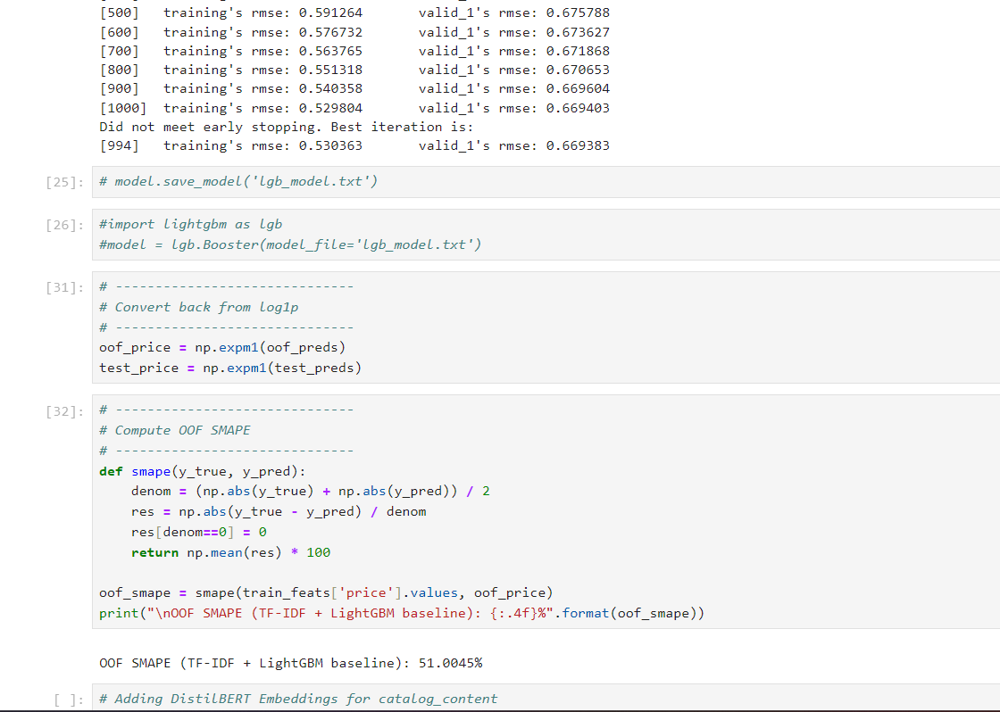

Multimodal Product Price Prediction (ML Challenge)

## 📘 Overview
This project focuses on building a **machine learning pipeline** to predict product prices from multi-modal data — including **text (catalog content)**, **numeric attributes (value, pack size)**, and **images**.  
We progressively design a model using **text + numeric + image features** to minimize SMAPE error.

---

## 🏗️ Project Structure
project/
├─ dataset/
│ ├─ train.csv
│ ├─ test.csv
├─ embeddings/
│ ├─ train_embeddings.npy
│ ├─ test_embeddings.npy
├─ notebooks/
│ ├─ text_baseline_tfidf.ipynb
│ ├─ text_embeddings_distilbert.ipynb
│ ├─ multimodal_pipeline.ipynb
├─ utils.py
├─ lgb_model.txt
└─ README.md

---

## 🚀 Pipeline Progress

### **Step 1 — Data Parsing**
Custom function `parse_catalog_text()` extracts structured info from unstructured text fields:
- Product name (`item_name`)
- Quantity value (`value`)
- Unit (`unit`)
- Pack quantity (`pack_qty`)

**Output Example:**
| raw | item_name | value | unit | pack_qty |
|------|------------|--------|------|-----------|
| "Log Cabin Sugar Free Syrup, 24 FL OZ (Pack of 12)" | "Log Cabin Sugar Free Syrup" | 288.0 | Fl Oz | 12.0 |

---

### **Step 2 — TF-IDF + LightGBM Baseline**
A textual baseline using **TF-IDF vectorization** over parsed catalog text (`raw`).

**Steps:**
1. Vectorize text with `TfidfVectorizer` (20k max features, n-grams = (1,2)).
2. Combine with numeric features (`value`, `pack_qty`, etc.).
3. Train **LightGBM** with 5-fold CV and early stopping.
4. Evaluate using SMAPE.

**Result Example:**
OOF SMAPE (TF-IDF + LightGBM baseline): ~51%   (Best score till now)

---

### **Step 3 — Semantic Text Embeddings (DistilBERT)**
Switched from sparse TF-IDF features to **Dense DistilBERT embeddings** (768-dim vectors) to capture semantic understanding.

**Process:**
- Generated embeddings for `train` and `test` in Google Colab (using GPU).
- Saved to `.npy` files:
embeddings/train_embeddings.npy
embeddings/test_embeddings.npy

- Combined with numeric features and retrained LightGBM.

**Result Example:**
OOF SMAPE (DistilBERT embeddings + LightGBM): ~55.8%   (Not Useful)

---

### **Step 4 — Dimensionality Reduction (Optional PCA)**
Tested PCA (128–256 dimensions) to compress embeddings.
- Result: No improvement; PCA dropped due to minor performance loss.

---

### **Step 5 — Next Phase: Multimodal Fusion (Text + Image + Numeric)**
We plan to integrate **CLIP (ViT-B/32)** image embeddings with DistilBERT + numeric features for a multimodal LightGBM model.

**Next Goals:**
- Extract CLIP embeddings in Colab for all images.
- Combine text + image + numeric features.
- Optimize LightGBM / Ensemble model for minimal SMAPE.

---

## ⚙️ Requirements

**Environment:**
- Python ≥ 3.9  
- GPU recommended (for BERT/CLIP embedding generation)

**Install Core Libraries:**
```bash
pip install pandas numpy scikit-learn lightgbm transformers sentence-transformers tqdm pillow
🧩 Key Files
File	Purpose
notebooks/text_baseline_tfidf.ipynb	Baseline TF-IDF + LightGBM model
notebooks/text_embeddings_distilbert.ipynb	DistilBERT embeddings integration
notebooks/multimodal_pipeline.ipynb	Combined Text + Image + Numeric pipeline
embeddings/*.npy	Pre-computed text/image embeddings
lgb_model.txt	Saved LightGBM model (trained on text embeddings)

📊 Evaluation Metric
SMAPE (Symmetric Mean Absolute Percentage Error) is used to evaluate model performance. 
Lower SMAPE = Better model.

🧠 Model Insights
Model	Features Used	OOF SMAPE
TF-IDF + LightGBM	Raw text + numeric	~51%
DistilBERT + LightGBM	Dense text embeddings + numeric	~55.8%
DistilBERT + PCA + LightGBM	Reduced text embeddings	~56.7%
(Planned) CLIP + DistilBERT + LightGBM	Multimodal	TBD

📌 Next Steps
Extract CLIP image embeddings (in Colab).

Merge text + numeric + image features.

Perform feature scaling or normalization if required.

Train multimodal LightGBM or ensemble model.

Optimize hyperparameters for minimal SMAPE.

🧾 Author
Developed by: [Mrityunjay Bhagat]
Environment: Local (Intel i5-12th Gen + RTX 2050) & Google Colab GPU
Goal: Build a robust multimodal price prediction model within 3-4 days.

Please refer to Untitled1.ipynb for if-idf + lite GBM.

